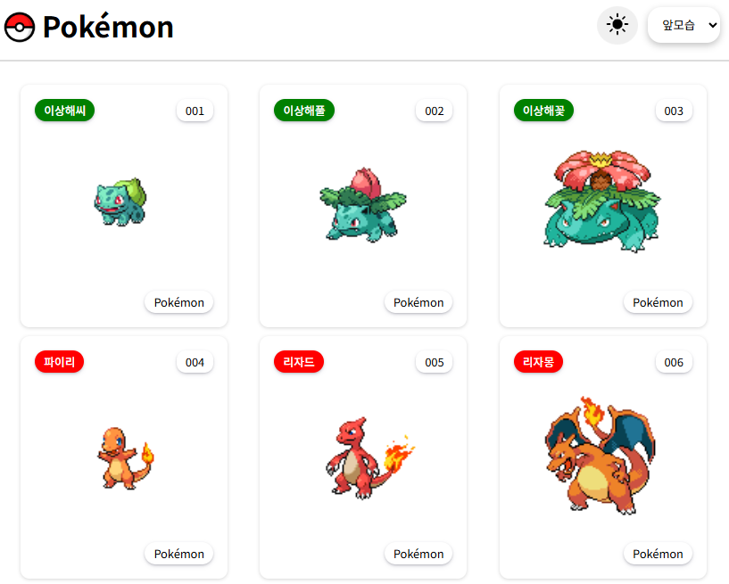

# 포켓몬 도감

- 2025-11-06 ~ 2025-11/27

## 기술내용

- axios를 사용해 포켓몬 API 호출
- 포켓몬 리스트 및 상세 데이터 상태 관리
- react-icon 사용
- react-intersection-observer를 사용해 무한스크롤 구현
- redux reducer를 활용한 전역 상태 관리로 포켓몬 이미지 타입 선택 버튼 구현
- Redux Toolkit(createSlice + createAsyncThunk)을 사용하여 전역 상태로 관리하도록 구조 재정비 [cardLIst,detail부분]
  - createSlice로 pokemon 상태(pokemons, loading) 생성
  - createAsyncThunk로 비동기 API 호출(fetchPokemon) 정의
  - configureStore를 통해 전역 store 구성
  - 컴포넌트에서는 dispatch(fetchPokemon())만 호출하도록 간단화
- 전체 UI는 Styled-Components를 사용하여 컴포넌트 단위로 스타일 관리
  - redux 상태 또는 api데이터에 따라 스타일이 바뀌어야 하는 부분은 props기반 동적 스타일링 적용
- 다크/라이트모드 구현.

## 시연 이미지

## 사이트 배포

- [포켓몬 도감 바로가기]
